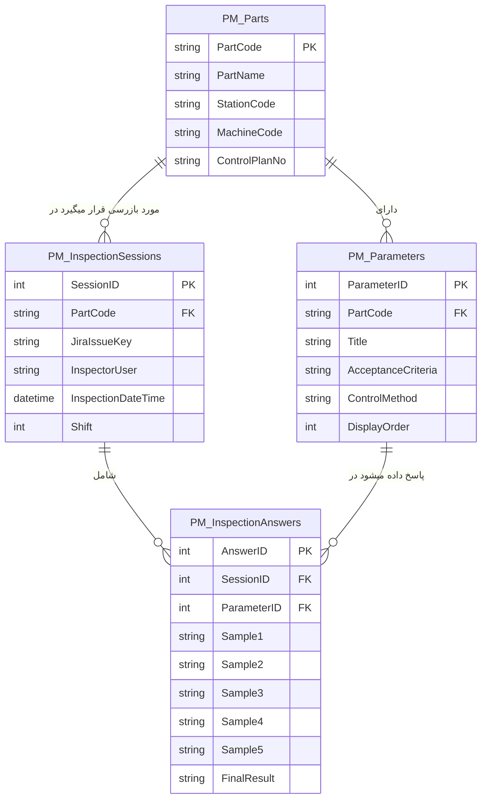

# معماری دیتابیس: افزونه Paperless Manufacturing
فرم هدف: بازرسی حین فرآیند تولید

> [!TIP]
> **نکته مهم:** از آنجا که به دیتابیس اصلی جیرا (`Jira-DB`) متصل می‌شویم، بهتر است تمام جداول اختصاصی خودمان را با یک پیشوند مشخص (مثلاً `PM_` مخفف Paperless Manufacturing) بسازیم تا با جداول استاندارد جیرا تداخلی نداشته باشند و مدیریت آن‌ها در آینده (مثلاً بکاپ‌گیری) راحت‌تر باشد.

## چرا به ۴ جدول نیاز داریم؟ (به جای ۳ جدول)
شما به درستی اشاره کردید که جدول پاسخ‌ها بسیار مهم است چون هر ۴ ساعت یک بار ثبت می‌شود. دقیقاً به همین دلیل، ما باید بخش «ثبت بازرسی» را به **دو جدول جداگانه (جداول ۳ و ۴)** بشکنیم: 
یکی برای ثبت **«نوبت بازرسی»** (کی و چه زمانی انجام شده) و دیگری برای ثبت **«ریز پاسخ‌های هر سوال»** (۵ نمونه و OK/NOK). 
اگر این دو را یکی کنیم، نام بازرس و زمان، برای تک تک پارامترهای یک فرم (مثلاً ۱۰ پارامتر) تکرار می‌شود که باعث کندی دیتابیس و سختی گزارش‌گیری می‌شود (افزونگی داده). ساختار ۴ جدولی (نرمال‌سازی شده) سرعت سیستم را به شدت بالا می‌برد.

---

## ساختار پیشنهادی جداول (Schema)

### ۱. جدول `PM_Parts` (اطلاعات پایه قطعات)
این جدول معادل همان دیتابیس مرجعی است که فرمودید. تمام اطلاعات ثابت هر کد قطعه در اینجا قرار می‌گیرد.
- `PartCode` (NVARCHAR(50), Primary Key): کد قطعه / محصول (کلید اصلی)
- `PartName` (NVARCHAR(255)): نام قطعه
- `StationCode` (NVARCHAR(100)): نام / کد ایستگاه بازرسی
- `MachineCode` (NVARCHAR(100)): کد ماشین
- `ControlPlanNo` (NVARCHAR(100)): شماره برنامه کنترل

### ۲. جدول `PM_Parameters` (سوالات و پارامترهای کنترل)
هر قطعه، لیست مشخصی از سوالات دارد که در این جدول نگهداری می‌شود.
- `ParameterID` (INT, IDENTITY, Primary Key): شناسه یکتای سوال
- `PartCode` (NVARCHAR(50), Foreign Key): لینک به جدول قطعات (کدام قطعه؟)
- `Title` (NVARCHAR(255)): عنوان سوال (مانند: پارامتر A، وزن قطعه، گازگیری)
- `AcceptanceCriteria` (NVARCHAR(MAX)): معیار پذیرش
- `ControlMethod` (NVARCHAR(100)): روش کنترل (چشمی، کولیس و ...)
- `DisplayOrder` (INT): ترتیب نمایش این سوال در فرم (تا سوالات همیشه با یک ترتیب مشخص رندر شوند)

### ۳. جدول `PM_InspectionSessions` (نوبت‌های بازرسی)
این همان **جدول مهمی** است که فرمودید. هر بار که بازرس دکمه "ثبت" فرم را می‌زند، **فقط یک رکورد** در این جدول ساخته می‌شود.
- `SessionID` (INT, IDENTITY, Primary Key): شناسه نوبت بازرسی
- `PartCode` (NVARCHAR(50), Foreign Key): لینک به کد قطعه
- `JiraIssueKey` (NVARCHAR(50)): شناسه تیکت در جیرا (برای اینکه بدانیم این بازرسی مربوط به کدام تسک/تیکت در جیرا بوده است)
- `InspectorUser` (NVARCHAR(100)): نام کاربری بازرس (توسط کی؟)
- `InspectionDateTime` (DATETIME): زمان و تاریخ دقیق ثبت فرم (در چه زمانی؟)
- `Shift` (INT): شیفت کاری (مثلا ۱ یا ۲ یا ۳) - *اختیاری*

### ۴. جدول `PM_InspectionAnswers` (ریز پاسخ‌ها)
به ازای هر سوال در یک نوبت بازرسی، یک رکورد در این جدول ساخته می‌شود تا مقادیر ۵ نمونه ثبت گردد.
- `AnswerID` (INT, IDENTITY, Primary Key): شناسه پاسخ
- `SessionID` (INT, Foreign Key): لینک به نوبت بازرسی (کدام جلسه بازرسی؟)
- `ParameterID` (INT, Foreign Key): لینک به سوال (جواب مربوط به کدام پارامتر است؟)
- `Sample1` (NVARCHAR(255)): مقدار نمونه ۱ (رشته‌ای در نظر گرفته می‌شود تا بتواند عدد یا متن باشد)
- `Sample2` (NVARCHAR(255)): مقدار نمونه ۲
- `Sample3` (NVARCHAR(255)): مقدار نمونه ۳
- `Sample4` (NVARCHAR(255)): مقدار نمونه ۴
- `Sample5` (NVARCHAR(255)): مقدار نمونه ۵
- `FinalResult` (NVARCHAR(10)): وضعیت نهایی (OK یا NOK)

---

## نمودار روابط جداول (ER Diagram)

