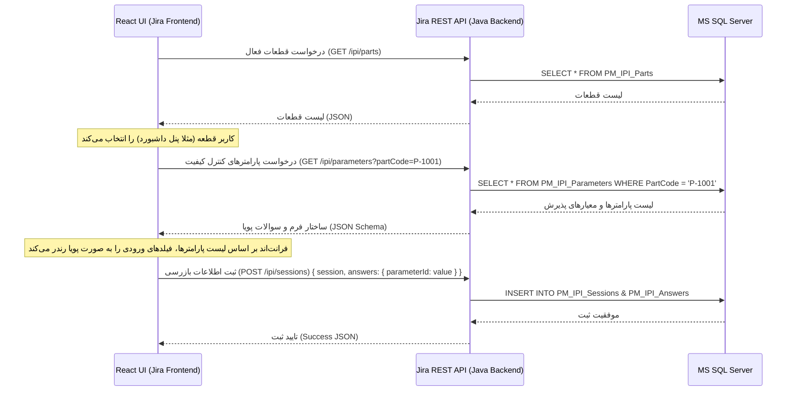

# سند معماری و طراحی راه‌حل (Solution Architecture Document)

این سند توصیف‌کننده معماری فنی «سامانه فرم‌های بدون کاغذ تولید» است. هدف اصلی این معماری، **کاهش وابستگی فرانت‌اند (UI) به تغییرات پایگاه‌داده** از طریق رویکرد «رابط کاربری متاداده‌محور پویا» (Metadata-Driven UI) است.

---

## ۱. مدل تعامل پویا (Dynamic Sequence Diagram)

نمودار توالی زیر نحوه تعامل فرانت‌اند React، وب‌سرویس REST جیرا و پایگاه‌داده SQL Server را برای تولید پویا و ثبت فرم بازرسی نشان می‌دهد:



---

## ۲. رندر پویای فیلدها در فرانت‌اند (Schema-Resilient UI)

در این رویکرد، در کدهای React هیچ فیلد ورودی به صورت ثابت (Static) تعریف نمی‌شود. پس از دریافت پاسخ از وب‌سرویس `/ipi/parameters`، رابط کاربری با استفاده از یک حلقه پویا، به ازای هر پارامتر، ردیف‌های بازرسی و فیلدهای اندازه‌گیری نمونه‌ها را رندر می‌کند.

### مثال از ساختار ورودی پویا (JSON Response for Parameters):
```json
[
  {
    "parameterId": 1,
    "title": "نوع مواد",
    "acceptanceCriteria": "ABS/PC - گرید مخصوص",
    "controlMethod": "مطابقت لیبل",
    "displayOrder": 1
  },
  {
    "parameterId": 2,
    "title": "ابعاد کلی",
    "acceptanceCriteria": "طول 120 ± 0.5 میلی‌متر",
    "controlMethod": "کولیس",
    "displayOrder": 2
  }
]
```

**مزیت کلیدی:** اگر در آینده پارامترهای بازرسی قطعه تغییر کند (مثلاً سوالی اضافه، حذف، ویرایش یا جابجا شود)، فقط کافیست داده‌های جدول `PM_IPI_Parameters` تغییر یابند. فرانت‌اند به طور خودکار در درخواست بعدی فرم جدید را رندر می‌کند و نیازی به تغییر یا کامپایل مجدد کدهای فرانت‌اند نخواهد بود.

---

## ۳. لایه وب‌سرویس (REST API Spec)

وب‌سرویس افزونه در جاوا از کلاس‌های Jakarta RESTful Web Services استفاده می‌کند تا هماهنگی کامل با جیرا ۱۱.۳.۴ داشته باشد.

### الف) دریافت لیست قطعات
- **آدرس:** `GET /rest/paperless/1.0/ipi/parts`
- **خروجی:**
  ```json
  [
    {
      "partCode": "P-1001",
      "partName": "پنل داشبورد",
      "stationCode": "ST-01",
      "machineCode": "M-501",
      "controlPlanNo": "CP-1001"
    }
  ]
  ```

### ب) دریافت پارامترهای یک قطعه
- **آدرس:** `GET /rest/paperless/1.0/ipi/parameters`
- **پارامترها:** `partCode` (مانند `P-1001`)

### ج) ثبت یک نشست بازرسی و پاسخ‌ها
- **آدرس:** `POST /rest/paperless/1.0/ipi/sessions`
- **ورودی (Request Body):**
  ```json
  {
    "partCode": "P-1001",
    "jiraIssueKey": "PM-101",
    "inspectorUser": "hossein558",
    "shift": 1,
    "answers": [
      {
        "parameterId": 1,
        "sample1": "OK",
        "sample2": "OK",
        "sample3": "OK",
        "sample4": "OK",
        "sample5": "OK",
        "finalResult": "OK"
      }
    ]
  }
  ```

---

## ۴. ارتباط با پایگاه‌داده (Database Access Layer)

اتصال به پایگاه‌داده به دو صورت قابل انجام است:
1. **استفاده از اتصالات جیرا (Recommended):** استفاده از `Jira Database Connection Pool` که در کلاس جاوا پیکربندی می‌شود. این روش تضمین می‌کند که مدیریت تراکنش‌ها و ارتباطات به صورت بهینه توسط خود سرور جیرا مدیریت می‌شود.
2. **اتصال مستقیم JDBC:** کدهای SQL مستقیماً از طریق درایور رسمی مایکروسافت (`Microsoft JDBC Driver for SQL Server`) اجرا می‌شوند تا تغییرات احتمالی فیزیکی جداول تأثیری در لایه دسترسی نداشته باشند.
